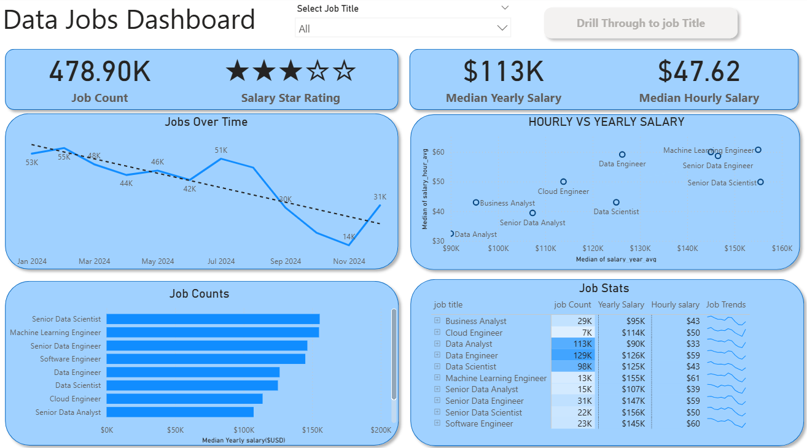
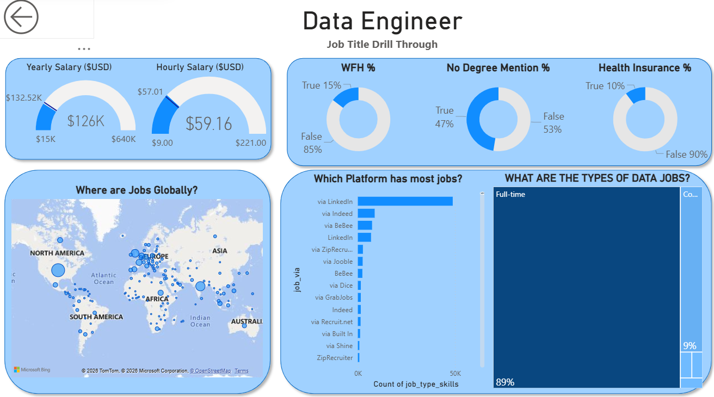

# 📊 Data Jobs Dashboard — Power BI

An interactive Power BI dashboard exploring the 2024 data job market — salaries, work setups, hiring platforms, and global job distribution — built to help job seekers and career switchers quickly size up the field.

---

## 🎯 Why this project

Job postings for data roles are scattered across dozens of sites, each with inconsistent salary info and vague requirements. This dashboard pulls a real-world dataset of 2024 data job postings into one place so you can actually compare roles — pay, remote-friendliness, degree requirements, benefits — side by side instead of digging through job boards one tab at a time.

## 🗂️ Repo contents

| File | Description |
|---|---|
| `Data_Jobs_Dashboard.pbix` | The full Power BI report file |
| `Resources/images/` | Screenshots and GIFs of the dashboard in action |

## 🧠 Skills demonstrated

- **Power Query (ETL):** Cleaned and shaped raw job posting data — handled blanks, fixed data types, engineered new columns.
- **DAX Measures:** Built measures for KPIs including median yearly/hourly salary and job counts.
- **Core visuals:** Line chart, bar chart, and scatter chart to compare roles and track posting trends over time.
- **Geospatial mapping:** Global map visual plotting job locations.
- **KPI cards & pivot table:** Cards for headline metrics, sortable table for role-by-role stats.
- **Interactivity:**
  - **Slicer** to filter by job title
  - **Buttons & bookmarks** for in-report navigation
  - **Drill-through** from the summary page into a per-role detail view

## 📄 Pages

### Page 1 — Market Overview
The high-level view: total job count, average job rating, median yearly/hourly salary, a trend line of postings over time, a scatter plot comparing hourly vs. median salary by role, and a ranked bar chart of job counts by title, plus a detailed stats table.

### Page 2 — Job Title Drill-Through
Click into any role from Page 1 to land here: salary ranges (gauges), work-from-home %, no-degree-required %, health insurance %, a treemap of schedule type (full-time / contract / part-time / intern), a bar chart of top hiring platforms, and a map of where those roles are posted globally.

## 🎥 See it in action

  
  

## 🔧 Tools

- Power BI Desktop (Power Query, DAX, data modeling, visuals)
- Power BI Service (publishing / live report)

## 🚀 Getting started

1. Clone this repo
2. Open `Data_Jobs_Dashboard.pbix` in Power BI Desktop
3. Explore Page 1, then click any bar in **Job Counts** to drill through to Page 2

---

⭐ If this was useful as a reference for your own Power BI project, feel free to star the repo.
